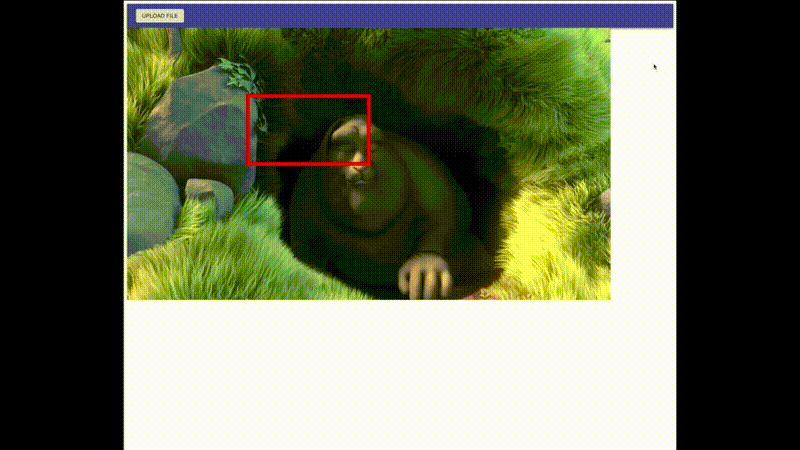

# react-video-player-and-konva
poc for react video player and konva

## Description

This repo is the first step to solving the goals mentioned below. This repo will simply allow a user to upload a video (client-side) and create a [react-konva](https://konvajs.org/docs/react/Intro.html) layer of the same size.  

<div>
        
</div>

## Installation

```shell
yarn
yarn start
```

## Motivation

I work with very talented data scientists and engineers. A lot of the models they are building are used to identify objects and actions in a video. Their models produce raw results in a CSV, JSON format. It is difficult to validate their results just from looking at the raw data. We have tried to feed the data into 3rd party tools to visualize the data in graphs, and there are a lot of python projects that can draw bounding boxes on images or videos .. but there doesn't seem to be a good solution to visualize bounding boxes on a video on a website.

## Goals

Make it easy to validate computer vision model results with bounding boxes for videos on a simple website.

- upload video
- draw bounding boxes over detected objects
- responsive
- ability to scrub through video easily
